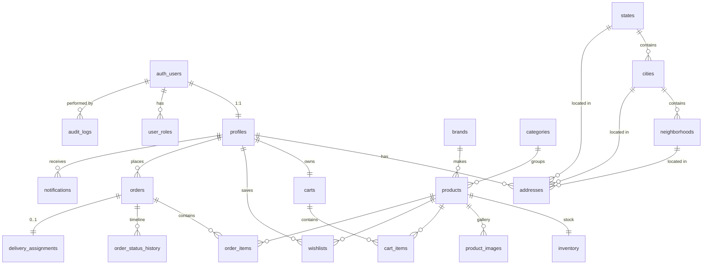

# Metacare Beauty — Entity Relationship Diagram

## Cardinality notes

- Every authenticated user has exactly one `profiles` row (auto-created via trigger) and exactly one `customer` role row in `user_roles`. Additional roles (`staff`, `admin`) can be granted by an admin.
- A `cart` is unique per `profile`. Items are deleted as a set when an order is placed.
- An `order` has zero or one `delivery_assignments` — created only when staff marks the order Out for Delivery. `delivery_assignments.agent_id` is nullable and no longer references a user (couriers are external, not system users).
- `order_status_history` is append-only and written by trigger on every status change.
- `audit_logs` is append-only; readable by staff/admin only.
